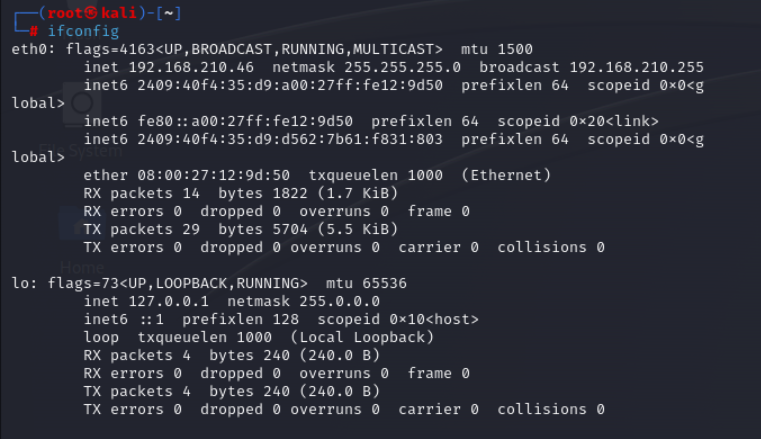
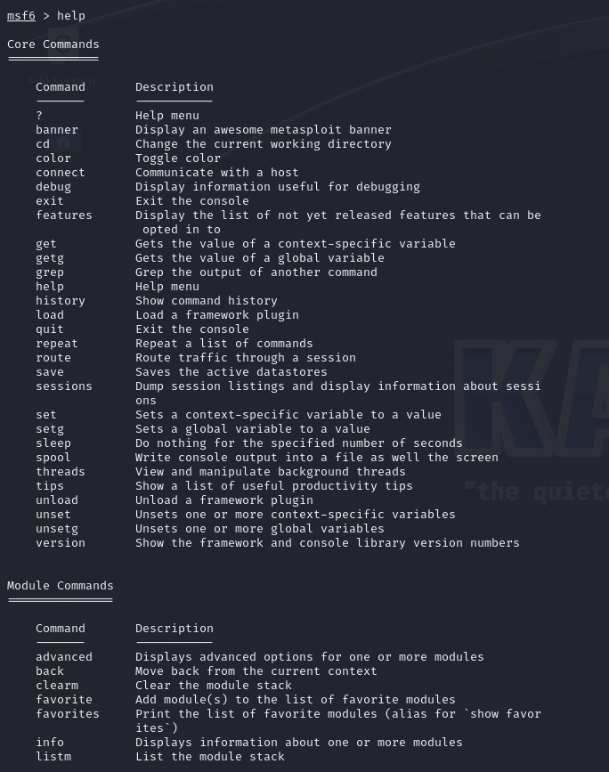

# EX 05: METASPLOIT-FOR-RECONNAISSANCE:
# Metasploit
Metasploit for reconnaissance in pentesting

## AIM:

To get introduced to Metasploit Framework and to  perform reconnaissance  in pentesting .

## DESIGN STEPS:

### Step 1:

Install kali linux either in partition or virtual box or in live mode

### Step 2:

Investigate on the various categories of tools as follows:

### Step 3:

Open terminal and try execute some kali linux commands

## EXECUTION STEPS AND ITS OUTPUT:

Find out the ip address of the attackers system
### OUTPUT:

## Invoke msfconsole
### OUTPUT:

Type help or a question mark "?" to see the list of all available commands you can use inside msfconsole.

## Port scanning:
### msf > nmap -sT 192.168.1810/24-p1-1000

### msf > db_nmap 192.168.181.0/24

### kali > ls-l

### search 

### info

## MYSQL ENUMERATION
### db_nmap -sV -sC -p 3306 <metasploitable_ip_address>

### search

###  use 11 Or: use auxiliary/scanner/mysql/mysql_version

### Use the set rhosts command to set the parameter and run the module, as follows:

### After scanning, you can also brute force MySQL root account via Metasploit's auxiliary(scanner/mysql/mysql_login) module.

### /usr/share/wordlists: set PASS_FILE /usr/share/wordlistss/rockyou.txt 

## RESULT:
The Metasploit framework for reconnaissance is  examined successfully
